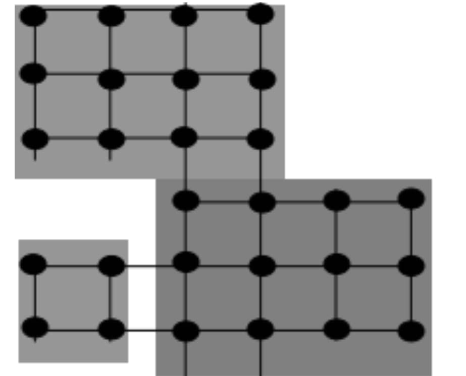

# euro-diffusion-lab

# Euro-diffusion-solution

## Formulation of a problem

On January 1, 2002, twelve European countries abandoned their national currency for a new currency, the euro. No more francs, marks, lires, guldens, kroner,... only euros, all over the eurozone. The same banknotes are used in all countries. And the same coins? Well, not quite. Each country has limited freedom to create its own euro coins: “Every euro coin carries a common European face. On the obverse, member states decorate the coins with their own motif. No matter which motif is on the coin, it can be used anywhere in the 12 Member States. For example, a French citizen is able to buy a hot dog in Berlin using a euro coin with the imprint of the King of Spain.” On January 1, 2002, the only euro coins available in Paris were French coins. Soon the first non-French coins appeared in Paris. Eventually, one may expect all types of coins to be evenly distributed over the twelve participating countries. (Actually this will not be true. All countries continue minting and distributing coins with their own motifs. So even in a stable situation, there should be an excess of German coins in Berlin.) So, how long will it be before the first Finnish or Irish coins are in circulation in the south of Italy? How long will it be before coins of each motif are available everywhere?

You must write a program to simulate the dissemination of euro coins throughout Europe, using a highly simplified model. Restrict your attention to a single euro denomination. Represent European cities as points in a rectangular grid:



Each city may have up to 4 neighbors (one to the north, east, south and west). Each city belongs to a country, and a country is a rectangular part of the plane. The figure below shows a map with 3 countries and 28 cities. The graph of countries is connected, but countries may border holes that represent seas, or non-euro countries such as Switzerland or Denmark. Initially, each city has one million (1000000) coins in its country’s motif. Every day a representative portion of coins, based on the city’s beginning day balance, is transported to each neighbor of the city. A representative portion is defined as one coin for every full 1000 coins of a motif.

A city is complete when at least one coin of each motif is present in that city. A country is complete when all of its cities are complete. Your program must determine the time required for each country to become complete.

## Input

The input consists of several test cases. The first line of each test case is the number of countries (1 ≤ c ≤ 20). The next c lines describe each country. The country description has the format: name xl yl xh yh, where name is a single word with at most 25 characters; xl, yl are the lower left city coordinates of that country (most southwestward city ) and xh, yh are the upper right city coordinates of that country (most northeastward city). 1 ≤ xl ≤ xh ≤ 10 and 1 ≤ yl ≤ yh ≤ 10. The last case in the input is followed by a single zero.

## Output

For each test case, print a line indicating the case number, followed by a line for each country with the country name and number of days for that country to become complete. Order the countries by days to completion. If two countries have identical days to completion, order them alphabetically by name. Use the output format shown in the example.

## Samples

#### Input:

```
3
France 1 4 4 6
Spain 3 1 6 3
Portugal 1 1 2 2
1
Luxembourg 1 1 1 1
2
Netherlands 1 3 2 4
Belgium 1 1 2 2
0
```

#### Expected output:

```
Case Number 1
Spain 382
Portugal 416
France 1325
Case Number 2
Luxembourg 0
Case Number 3
Belgium 2
Netherlands 2
```
